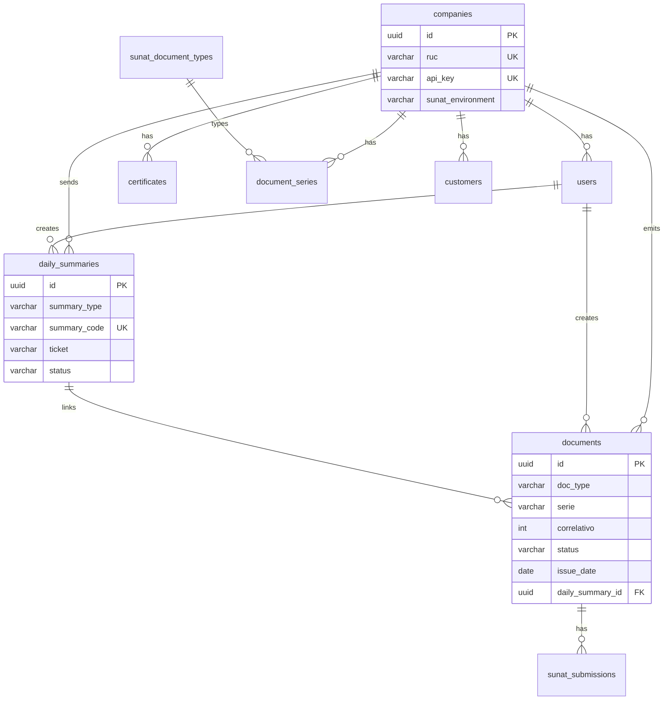

# Base de datos — mind-billing-api

PostgreSQL multi-tenant para facturación electrónica SUNAT (Perú).

| Fuente de verdad | Ubicación |
|------------------|-----------|
| Migraciones TypeORM | `src/database/migrations/` |
| Entidades | `src/**/entities/` |
| Seed dev | `src/database/seeds/run-seed.ts` |
| SQL manual (backup) | `scripts/sql/` |

Comando setup: `npm run db:setup` → migraciones + seed idempotente.

---

## Diagrama ER



---

## Historial de migraciones

| Migración | Sprint | Cambios |
|-----------|--------|---------|
| `1710000000000-InitialSchema` | 1 | Tablas base: catálogo, companies, users, series, customers, certificates, documents, sunat_submissions |
| `1710000000001-Sprint2Closure` | 2 | `sunat_submissions.error_message`; unique `(company_id, doc_type, serie, correlativo)` en documents |
| `1710000000002-Sprint3BoletasRc` | 3 | Tabla `daily_summaries`; `documents.issue_date`, `documents.daily_summary_id` |
| `1710000000003-Sprint3NotesRa` | 3 | `daily_summaries.summary_type` (`RC` \| `RA`) |

---

## Tablas

### `sunat_document_types`

Catálogo SUNAT N° 01 — tipos de comprobante (global, no por empresa).

| Columna | Tipo | Notas |
|---------|------|-------|
| `code` | varchar(2) PK | `01`, `03`, `07`, `08`, … |
| `name` | varchar(100) | |
| `description` | text | |
| `is_active` | boolean | default `true` |

Seed: `01` Factura, `03` Boleta, `07` NC, `08` ND, `09` GRE remitente, etc.

---

### `companies`

Tenant emisor. Resuelto por `X-Api-Key` en cada request.

| Columna | Tipo | Notas |
|---------|------|-------|
| `id` | uuid PK | |
| `ruc` | varchar(11) UK | 11 dígitos |
| `api_key` | varchar(64) UK | Tenant key |
| `business_name` | varchar(255) | Razón social |
| `trade_name` | varchar(255) | |
| `address` | varchar(500) | |
| `ubigeo` | varchar(6) | |
| `sunat_environment` | varchar(20) | `beta` \| `homologacion` \| `production` |
| `sol_username` | varchar(100) | Credencial SOL; beta: `{ruc}MODDATOS` |
| `sol_password` | varchar(100) | |
| `is_active` | boolean | |
| `created_at` / `updated_at` | timestamptz | |

**Índices:** `IDX_companies_api_key_active` (parcial `is_active = true`).

**Dev seed:**

| Campo | Valor |
|-------|-------|
| `id` | `00000000-0000-4000-8000-000000000001` |
| `ruc` | `20000000001` |
| `api_key` | `mbak_dev00000000000000000000000001` |
| `sunat_environment` | `beta` |
| `sol_username` | `20000000001MODDATOS` |
| `sol_password` | `MODDATOS` |

---

### `users`

Usuarios por empresa. JWT incluye `userId` + contexto company del API key.

| Columna | Tipo | Notas |
|---------|------|-------|
| `id` | uuid PK | |
| `company_id` | uuid FK → companies | CASCADE |
| `username` | varchar(100) | UK con `company_id` |
| `password_hash` | varchar(255) | bcrypt |
| `full_name` | varchar(255) | |
| `is_active` | boolean | |
| `created_at` / `updated_at` | timestamptz | |

**Dev:** `admin` / `admin123`, id `00000000-0000-4000-8000-000000000010`.

---

### `certificates`

Certificado digital (.pfx) por empresa para firma XML.

| Columna | Tipo | Notas |
|---------|------|-------|
| `id` | uuid PK | |
| `company_id` | uuid FK → companies | CASCADE |
| `alias` | varchar(100) | |
| `pfx_path` | varchar(500) | Ruta relativa, ej. `certs/dev-beta.pfx` |
| `pfx_password` | varchar(255) | Texto plano hoy; cifrado en backlog |
| `valid_from` / `valid_to` | date | |
| `is_active` | boolean | Una activa por empresa en runtime |
| `created_at` | timestamptz | |

---

### `document_series`

Correlativo por `(empresa, tipo doc, serie)`.

| Columna | Tipo | Notas |
|---------|------|-------|
| `id` | uuid PK | |
| `company_id` | uuid FK → companies | CASCADE |
| `doc_type` | varchar(2) FK → sunat_document_types | |
| `serie` | varchar(4) | ej. `F001`, `B001`, `FC01` |
| `correlativo` | int | Último usado; default `0` |
| `is_active` | boolean | |
| `created_at` | timestamptz | |

**UK:** `(company_id, doc_type, serie)`.

**Dev seed:**

| doc_type | serie |
|----------|-------|
| `01` | `F001` |
| `03` | `B001` |
| `07` | `FC01`, `BC01` |
| `08` | `FD01`, `BD01` |

Incremento con lock pessimista al emitir documento.

---

### `customers`

Clientes/receptores por empresa (catálogo local).

| Columna | Tipo | Notas |
|---------|------|-------|
| `id` | uuid PK | |
| `company_id` | uuid FK → companies | CASCADE |
| `doc_type` | varchar(1) | Catálogo 06: `1` DNI, `6` RUC, … |
| `doc_number` | varchar(15) | |
| `legal_name` | varchar(255) | |
| `email` / `phone` / `address` / `ubigeo` | | |
| `is_active` | boolean | |
| `created_at` / `updated_at` | timestamptz | |

**UK:** `(company_id, doc_type, doc_number)`.

> Los comprobantes también guardan cliente en `documents.payload` al emitir; `customers` es catálogo opcional/reutilizable.

---

### `documents`

Comprobantes electrónicos emitidos.

| Columna | Tipo | Notas |
|---------|------|-------|
| `id` | uuid PK | |
| `company_id` | uuid FK → companies | CASCADE |
| `created_by` | uuid FK → users | SET NULL |
| `doc_type` | varchar(2) | `01`, `03`, `07`, `08` |
| `serie` | varchar(4) | |
| `correlativo` | int | |
| `status` | varchar(20) | Ver enum abajo |
| `total` | decimal(12,2) | |
| `payload` | jsonb | Request + metadata (ver sección payload) |
| `xml_content` | text | UBL firmado |
| `issue_date` | date | Fecha emisión comprobante |
| `daily_summary_id` | uuid FK → daily_summaries | SET NULL; RC/RA que lo informó |
| `created_at` / `updated_at` | timestamptz | |

**UK:** `(company_id, doc_type, serie, correlativo)`.

**Índice parcial:** `IDX_documents_pending_rc` — `(company_id, doc_type, status, issue_date)` WHERE `doc_type = '03' AND daily_summary_id IS NULL`.

#### Enum `status` (`DocumentStatus`)

| Valor | Uso |
|-------|-----|
| `draft` | Transitorio NC factura antes sendBill |
| `signed` | Boleta / NC boleta firmada, pendiente RC |
| `submitted` | Enviado sendBill (transitorio) |
| `accepted` | CDR aceptado |
| `rejected` | SUNAT rechazó |
| `failed` | Error técnico |
| `observed` | Reservado |
| `voided` | Anulado (RC void o RA) |

#### Campo `payload` (jsonb)

Estructura típica (`DocumentPayload`):

```json
{
  "cliente": { "tipoDoc": "6", "numDoc": "20100066603", "razonSocial": "..." },
  "moneda": "PEN",
  "items": [ ... ],
  "totals": { "subtotal": 84.75, "igvTotal": 15.25, "total": 100.00 },
  "documentoAfectado": { "docType": "03", "serie": "B001", "correlativo": 1 },
  "motivoCodigo": "01",
  "motivoDescripcion": "...",
  "_rcVoid": {
    "voidSummaryId": "uuid-rc-void-en-curso",
    "originalDailySummaryId": "uuid-rc-original"
  }
}
```

| Clave | Cuándo |
|-------|--------|
| `documentoAfectado` | Notas 07/08 — referencia en RC |
| `_rcVoid` | RC void en curso; rollback si falla sin ticket |

---

### `daily_summaries`

Resúmenes SUNAT: **RC** (comunicación de comprobantes) y **RA** (bajas de facturas).

| Columna | Tipo | Notas |
|---------|------|-------|
| `id` | uuid PK | |
| `company_id` | uuid FK → companies | CASCADE |
| `created_by` | uuid FK → users | SET NULL |
| `summary_type` | varchar(2) | `RC` (default) \| `RA` |
| `summary_code` | varchar(30) | `RC-YYYYMMDD-N` o `RA-YYYYMMDD-N` |
| `reference_date` | date | Emisión docs en líneas |
| `issue_date` | date | Fecha envío comunicación |
| `correlativo` | int | Secuencia por `(company, summary_type, issue_date)` |
| `status` | varchar(20) | Ver enum abajo |
| `ticket` | varchar(100) | De `sendSummary` |
| `status_code` | varchar(10) | Código SUNAT del CDR |
| `cdr_xml` | text | CDR completo |
| `error_message` | text | |
| `xml_content` | text | XML firmado enviado |
| `created_at` / `updated_at` | timestamptz | |

**UK:** `(company_id, summary_code)`.

**Índices:**

- `IDX_daily_summaries_company_reference` — `(company_id, reference_date)`
- `IDX_daily_summaries_company_type_issue` — `(company_id, summary_type, issue_date)`

#### Enum `summary_type`

| Valor | XML | Documentos vinculados |
|-------|-----|------------------------|
| `RC` | `SummaryDocuments` | Boletas 03, notas 07/08 en `documents.daily_summary_id` |
| `RA` | `VoidedDocuments` | Facturas 01 en `documents.daily_summary_id` |

#### Enum `status` (`DailySummaryStatus`)

| Valor | Significado |
|-------|-------------|
| `draft` | Creado, XML firmado, aún no enviado |
| `submitted` | Enviando a SUNAT |
| `processing` | Ticket recibido; polling pendiente |
| `accepted` | CDR OK |
| `rejected` | SUNAT rechazó |
| `failed` | Error técnico (HTTP, timeout) |

#### Relación con `documents`

- **RC altas:** docs `signed` → tras aceptar RC → `accepted`, `daily_summary_id` permanece.
- **RC void:** boletas `accepted` → tras aceptar → `voided`.
- **RA:** facturas `accepted` → tras aceptar → `voided`.
- **Fallo sin ticket:** API puede poner `daily_summary_id = NULL` en docs afectados.

---

### `sunat_submissions`

Historial de envíos `sendBill` por documento (facturas, NC/ND factura).

| Columna | Tipo | Notas |
|---------|------|-------|
| `id` | uuid PK | |
| `document_id` | uuid FK → documents | CASCADE |
| `method` | varchar(50) | `sendBill` |
| `ticket` | varchar(100) | Null en sendBill síncrono |
| `status_code` | varchar(10) | Del CDR |
| `cdr_xml` | text | |
| `error_message` | text | Sprint 2+ |
| `created_at` | timestamptz | |

> RC/RA no usan esta tabla; su CDR va en `daily_summaries.cdr_xml`.

---

## Modelo multi-tenant

```
Request → X-Api-Key → companies.id → filtro en todas las queries
JWT → users.id (created_by en docs y summaries)
```

Todas las tablas de negocio (excepto `sunat_document_types`) tienen `company_id`.

---

## Consultas útiles

### Boletas pendientes de RC hoy

```sql
SELECT id, serie, correlativo, status, issue_date
FROM documents
WHERE company_id = '<uuid>'
  AND doc_type IN ('03', '07', '08')
  AND status = 'signed'
  AND daily_summary_id IS NULL
  AND issue_date = CURRENT_DATE;
```

### Boletas anulables (void)

```sql
SELECT id, serie, correlativo, issue_date, daily_summary_id
FROM documents
WHERE company_id = '<uuid>'
  AND doc_type = '03'
  AND status = 'accepted'
  AND daily_summary_id IS NOT NULL;
```

### Facturas anulables (RA)

```sql
SELECT id, serie, correlativo, issue_date
FROM documents
WHERE company_id = '<uuid>'
  AND doc_type = '01'
  AND status = 'accepted'
  AND daily_summary_id IS NULL;
```

### RC/RA con ticket pendiente

```sql
SELECT id, summary_type, summary_code, status, ticket, error_message
FROM daily_summaries
WHERE company_id = '<uuid>'
  AND ticket IS NOT NULL
  AND status NOT IN ('accepted', 'rejected')
ORDER BY created_at DESC;
```

### Reset dev (RC/RA atascado)

```sql
UPDATE documents SET daily_summary_id = NULL WHERE daily_summary_id = '<summary-uuid>';
UPDATE daily_summaries SET status = 'rejected', error_message = 'Dev reset' WHERE id = '<summary-uuid>';
```

---

## Almacenamiento de archivos (filesystem)

Solo certificados `.pfx` del emisor (firma XML). UBL y CDR viven en PostgreSQL (`xml_content`, `cdr_xml`).

```
storage/{company_id}/{pfx_path}
```

Config: `STORAGE_PATH` en `.env` (default `./storage`).

---

## Configuración `.env` BD

```env
DB_HOST=localhost
DB_PORT=5433
DB_USER=mind_billing
DB_PASSWORD=mind_billing_dev
DB_NAME=mind_billing
DB_SYNC=false
DB_MIGRATIONS_RUN=true
DB_SEED_ON_START=auto
```

---

## Referencias

- Skill: `.cursor/skills/sunat-fe/base-de-datos.md`
- Reglas SUNAT: `.cursor/skills/sunat-fe/SKILL.md`
- Roadmap: `docs/ROADMAP.md`
